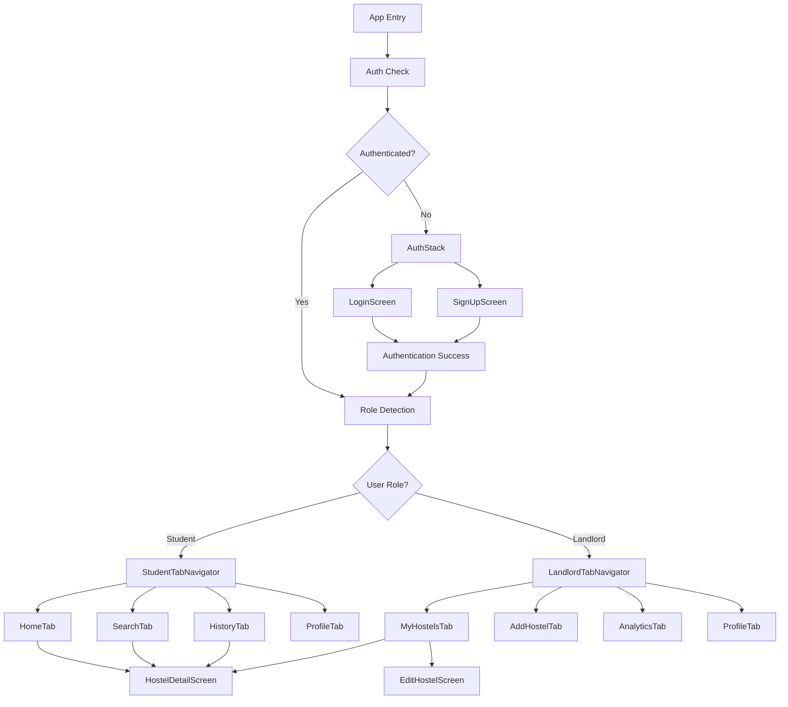

# Design Document

## Overview

CampusCrib is a React Native mobile application built with Expo that connects students with hostels in Ghana. The app features role-based navigation, real-time hostel search, booking history tracking, and landlord management capabilities. The architecture leverages Supabase for authentication and database services, integrates with the free Hostel API UCC, and maintains a clean separation between student and landlord experiences through distinct navigation flows.

## Architecture

### High-Level Architecture

```
┌─────────────────┐    ┌──────────────────┐    ┌─────────────────┐
│   Mobile App    │    │    Supabase      │    │  Hostel API UCC │
│  (React Native) │◄──►│   (Auth + DB)    │    │   (External)    │
│     + Expo      │    │                  │    │                 │
└─────────────────┘    └──────────────────┘    └─────────────────┘
```

### Technology Stack

- **Frontend**: React Native with Expo SDK
- **Navigation**: React Navigation v6 with Bottom Tab Navigator
- **Authentication**: Supabase Auth
- **Database**: Supabase PostgreSQL with Row Level Security
- **External API**: Hostel API UCC (free tier)
- **State Management**: React Context API
- **Image Storage**: Supabase Storage
- **Code Quality**: ESLint + Prettier
- **Maps**: React Native Maps (optional)
- **Notifications**: Expo Push Notifications

### Data Flow

1. **Authentication Flow**: User authenticates via Supabase Auth → Role detection → Route to appropriate navigation stack
2. **Hostel Discovery**: Fetch from Hostel API UCC → Display in app → Cache for offline access
3. **Landlord Management**: CRUD operations on Supabase hostels table → Sync with local state
4. **Analytics**: Aggregate booking_history data → Generate insights → Display visual analytics

## Components and Interfaces

### Core Components

#### Authentication Components

- `AuthStack`: Stack navigator for login/signup screens
- `LoginScreen`: Email/password authentication
- `SignUpScreen`: User registration with role selection
- `RoleDetector`: Determines user role and routes accordingly

#### Student Components

- `StudentTabNavigator`: Bottom tab navigation for students
- `HomeScreen`: Displays hostel listings from API
- `SearchScreen`: Hostel search with live filtering
- `HistoryScreen`: Student's booking/inquiry history
- `StudentProfileScreen`: Profile management and logout

#### Landlord Components

- `LandlordTabNavigator`: Bottom tab navigation for landlords
- `MyHostelsScreen`: Dashboard showing landlord's hostels
- `AddHostelScreen`: Form for adding new hostels
- `EditHostelScreen`: Form for editing existing hostels
- `AnalyticsScreen`: Smart analytics dashboard
- `LandlordProfileScreen`: Profile management and logout

#### Shared Components

- `HostelDetailScreen`: Detailed hostel view with contact options
- `HostelCard`: Reusable hostel display component
- `LoadingSpinner`: Loading state indicator
- `ErrorBoundary`: Error handling wrapper
- `ImageCarousel`: Image gallery component

### API Interfaces

#### Hostel API UCC Integration

```typescript
interface HostelAPIService {
  getHostels(): Promise<Hostel[]>;
  getHostelById(id: string): Promise<HostelDetail>;
  searchHostels(query: string): Promise<Hostel[]>;
}
```

#### Supabase Integration

````typescript
interface SupabaseService {
  auth: AuthService
  hostels: HostelService
  bookingHistory: BookingHistoryService
  profiles: ProfileService
}
```#
# Data Models

### Supabase Database Schema

#### profiles table
```sql
CREATE TABLE profiles (
  id UUID REFERENCES auth.users ON DELETE CASCADE,
  email TEXT NOT NULL,
  role TEXT CHECK (role IN ('student', 'landlord')) NOT NULL,
  name TEXT,
  phone TEXT,
  created_at TIMESTAMP WITH TIME ZONE DEFAULT NOW(),
  updated_at TIMESTAMP WITH TIME ZONE DEFAULT NOW(),
  PRIMARY KEY (id)
);
````

#### hostels table

```sql
CREATE TABLE hostels (
  id UUID DEFAULT gen_random_uuid() PRIMARY KEY,
  landlord_id UUID REFERENCES profiles(id) ON DELETE CASCADE,
  name TEXT NOT NULL,
  description TEXT,
  address TEXT NOT NULL,
  price DECIMAL(10,2) NOT NULL,
  amenities JSONB DEFAULT '[]',
  images TEXT[] DEFAULT '{}',
  contact_phone TEXT,
  contact_email TEXT,
  is_active BOOLEAN DEFAULT true,
  created_at TIMESTAMP WITH TIME ZONE DEFAULT NOW(),
  updated_at TIMESTAMP WITH TIME ZONE DEFAULT NOW()
);
```

#### booking_history table

```sql
CREATE TABLE booking_history (
  id UUID DEFAULT gen_random_uuid() PRIMARY KEY,
  student_id UUID REFERENCES profiles(id) ON DELETE CASCADE,
  hostel_id UUID, -- Can reference external API hostels
  hostel_name TEXT NOT NULL,
  action TEXT CHECK (action IN ('viewed', 'contacted')) NOT NULL,
  timestamp TIMESTAMP WITH TIME ZONE DEFAULT NOW(),
  metadata JSONB DEFAULT '{}'
);
```

### TypeScript Interfaces

#### Core Data Types

```typescript
interface User {
  id: string;
  email: string;
  role: 'student' | 'landlord';
  name?: string;
  phone?: string;
}

interface Hostel {
  id: string;
  name: string;
  description?: string;
  address: string;
  price: number;
  amenities: string[];
  images: string[];
  contactPhone?: string;
  contactEmail?: string;
  isActive: boolean;
}

interface BookingHistoryEntry {
  id: string;
  studentId: string;
  hostelId: string;
  hostelName: string;
  action: 'viewed' | 'contacted';
  timestamp: Date;
  metadata?: Record<string, any>;
}

interface AnalyticsData {
  hostelId: string;
  hostelName: string;
  totalViews: number;
  totalContacts: number;
  conversionRate: number;
  ranking: number;
  trendData: {
    date: string;
    views: number;
    contacts: number;
  }[];
}
```

## Error Handling

### Error Handling Strategy

#### Network Errors

- Implement exponential backoff for API retries
- Display user-friendly error messages
- Provide offline fallback where possible
- Cache successful API responses for offline access

#### Authentication Errors

- Handle token expiration gracefully
- Redirect to login on authentication failures
- Provide clear error messages for invalid credentials
- Implement secure logout on security errors

#### Data Validation Errors

- Client-side validation before API calls
- Server-side validation with clear error responses
- Form validation with real-time feedback
- Image upload validation (size, format, etc.)

#### Error Boundary Implementation

```typescript
class ErrorBoundary extends React.Component {
  // Catch JavaScript errors anywhere in child component tree
  // Log error details and display fallback UI
  // Provide retry mechanisms where appropriate
}
```

### Error Recovery Patterns

- Retry mechanisms for transient failures
- Graceful degradation for non-critical features
- Local state recovery from AsyncStorage
- User-initiated refresh options

## Testing Strategy

### Testing Pyramid

#### Unit Tests (70%)

- Component rendering and props handling
- Utility functions and data transformations
- API service methods
- State management logic
- Form validation functions

#### Integration Tests (20%)

- Navigation flows between screens
- API integration with mock responses
- Database operations with test data
- Authentication flows
- Image upload and storage

#### End-to-End Tests (10%)

- Complete user journeys (student and landlord)
- Cross-platform compatibility testing
- Performance testing on different devices
- Accessibility testing with screen readers

### Testing Tools and Framework

- **Unit Testing**: Jest + React Native Testing Library
- **Integration Testing**: Detox for E2E testing
- **API Testing**: Mock Service Worker (MSW)
- **Performance Testing**: Flipper integration
- **Accessibility Testing**: Built-in accessibility testing tools

### Test Coverage Goals

- Minimum 80% code coverage for critical paths
- 100% coverage for authentication and payment flows
- Performance benchmarks for key user interactions
- Accessibility compliance verification

### Continuous Integration

- Automated test runs on pull requests
- Code quality checks with ESLint/Prettier
- Build verification for both iOS and Android
- Automated deployment to staging environment## Na
  vigation Architecture

### Navigation Structure



### Screen Flow Specifications

#### Student Navigation Flow

- **HomeTab**: Displays hostel listings with pull-to-refresh
- **SearchTab**: Real-time search with debounced input
- **HistoryTab**: Paginated booking history with filters
- **ProfileTab**: User settings and logout functionality

#### Landlord Navigation Flow

- **MyHostelsTab**: Dashboard with hostel management actions
- **AddHostelTab**: Multi-step form for hostel creation
- **AnalyticsTab**: Interactive charts and performance metrics
- **ProfileTab**: Account management and business settings

### Deep Linking Strategy

- Support for hostel detail deep links
- Authentication state preservation
- Role-based route protection
- Fallback handling for invalid routes

## Security Considerations

### Authentication Security

- Secure token storage using Expo SecureStore
- Automatic token refresh handling
- Session timeout management
- Biometric authentication support (optional)

### Data Security

- Row Level Security (RLS) policies in Supabase
- Input sanitization and validation
- Secure image upload with file type validation
- API rate limiting and abuse prevention

### Privacy Protection

- GDPR compliance for user data
- Opt-in analytics and tracking
- Secure data transmission (HTTPS only)
- User data deletion capabilities

## Performance Optimization

### App Performance

- Lazy loading for non-critical screens
- Image optimization and caching
- Efficient list rendering with FlatList
- Memory management for large datasets

### Network Performance

- API response caching strategy
- Optimistic UI updates
- Background sync for offline support
- Compression for image uploads

### Database Performance

- Efficient query patterns with proper indexing
- Pagination for large datasets
- Connection pooling optimization
- Query result caching

## Accessibility Design

### WCAG 2.1 Compliance

- Minimum color contrast ratios (4.5:1)
- Scalable text support (up to 200%)
- Keyboard navigation support
- Screen reader compatibility

### Inclusive Design Features

- Alternative text for all images
- Semantic HTML structure
- Focus management for navigation
- Voice-over support for iOS
- TalkBack support for Android

### Accessibility Testing

- Automated accessibility testing in CI/CD
- Manual testing with assistive technologies
- User testing with accessibility needs
- Regular accessibility audits

## Deployment and DevOps

### Development Environment

- Expo development build configuration
- Environment-specific configuration files
- Local development with Expo CLI
- Hot reloading and debugging setup

### Staging Environment

- Automated builds from development branch
- Integration testing environment
- Stakeholder review and approval process
- Performance monitoring and analytics

### Production Deployment

- App Store and Google Play Store deployment
- Over-the-air updates with Expo Updates
- Production monitoring and error tracking
- Rollback capabilities for critical issues

### Monitoring and Analytics

- Crash reporting with Sentry
- Performance monitoring with Flipper
- User analytics with privacy compliance
- Business metrics tracking for landlords
